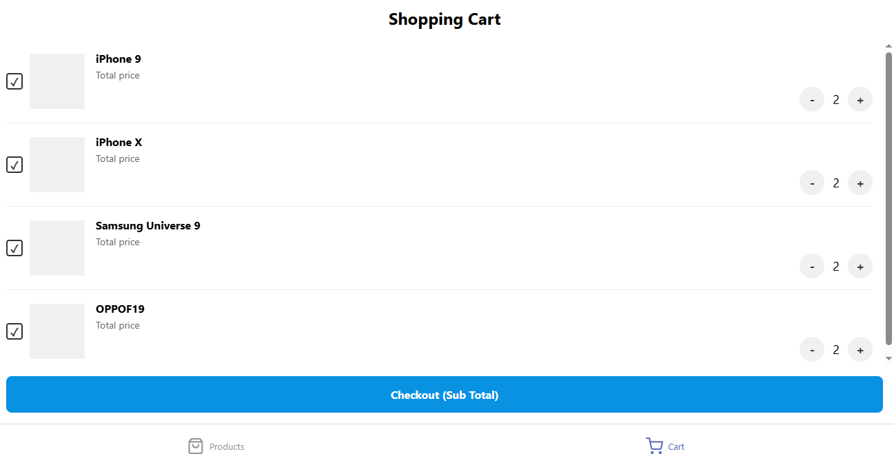
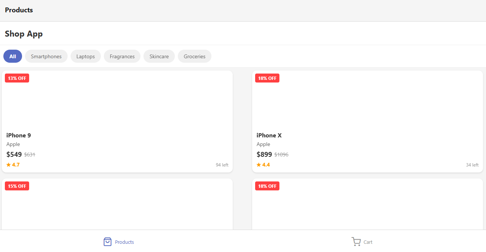

# React Native E-Commerce App

Aplikasi e-commerce mobile yang dibangun dengan React Native, menampilkan produk dari API DummyJSON dengan pengalaman belanja modern dan intuitif.

## Tampilan Aplikasi


## Tampilan Aplikasi



## Fitur Utama

- **Katalog Produk**: 
  - Tampilan grid produk dengan informasi detail seperti harga, rating, dan diskon
  - Filter produk berdasarkan kategori
  - Tampilan diskon yang menonjol untuk penawaran khusus

- **Keranjang Belanja**: 
  - Tambah/hapus produk dari keranjang
  - Ubah jumlah item
  - Lihat subtotal belanjaan
  - Proses checkout

- **Pengalaman Pengguna**:
  - Navigasi tab sederhana antara halaman produk dan keranjang
  - Loading indicator saat memuat data
  - Interface yang responsif dan modern

## Teknologi

- **React Native**: Framework mobile untuk pengembangan iOS & Android
- **TypeScript**: Bahasa pemrograman yang memberikan type safety
- **Expo**: Platform untuk memudahkan pengembangan dan pengujian
- **REST API**: Integrasi dengan API eksternal (DummyJSON)

## Struktur Proyek

```
src/
├── components/      # Komponen yang dapat digunakan kembali
├── screens/         # Halaman utama aplikasi
├── services/        # Layanan untuk API dan database
├── redux/           # State management dengan Redux
│   └── slices/      # Redux slices untuk produk, keranjang, dll
├── types/           # Type definitions
└── utils/           # Fungsi utilitas
```

## Optimasi Performa

Aplikasi ini dioptimalkan untuk performa dengan fokus pada:

- **Time to First Byte (TTFB)**: Pengambilan data yang efisien
- **First Contentful Paint (FCP)**: Rendering konten pertama yang cepat
- **Time to Interactive (TTI)**: Waktu minimum hingga aplikasi dapat berinteraksi

## Mulai Menggunakan

### Prasyarat

- Node.js 14.0 atau lebih baru
- npm atau yarn

### Instalasi

1. Clone repositori
   ```
   git clone https://github.com/username/react-native-ecommerce.git
   ```

2. Install dependencies
   ```
   npm install
   # atau
   yarn install
   ```

3. Jalankan aplikasi
   ```
   npm start
   # atau
   yarn start
   ```

4. Scan QR code dengan aplikasi Expo Go pada perangkat mobile atau gunakan emulator

## Pengembangan Lebih Lanjut

- Integrasi autentikasi pengguna
- Sistem pencarian produk
- Halaman detail produk
- Sistem favorit produk
- Riwayat pesanan pengguna

## Kontribusi

Kontribusi selalu diterima. Silakan fork repositori, buat branch untuk fitur, dan kirimkan pull request.

## Lisensi

MIT